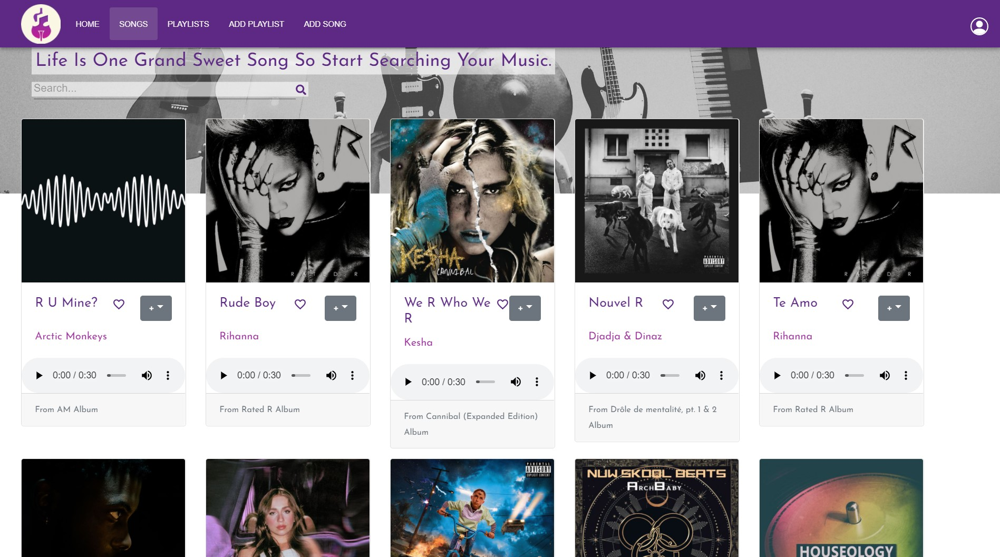

# Melodies App Front End

<!-- PROJECT LOGO -->
<br />
<p align="center">
  <a href="">
    
  </a>

  <h3 align="center">Melodies App</h3>

  <p align="center">
    A Music App Allows Users To Listen, Explore And Search For Their Music !
    <br />
    <a href="https://pages.git.generalassemb.ly/xloli20/MelodiesAppFrontEnd/"><strong>Go to the app »</strong></a>
    <br />
    <br />
    <a href="https://git.generalassemb.ly/xloli20/MelodiesAppBackEnd">Melodies App Back End</a>
    ·
    <a href="http://melodieswebapp-env.eba-kgzwebax.us-east-2.elasticbeanstalk.com/">API URL</a>
  </p>
</p>


<!-- TABLE OF CONTENTS -->
<details open="open">
  <summary>Table of Contents</summary>
  <ol>
    <li>
      <a href="#about-the-project">About The Project</a>
      <ul>
        <li><a href="#technologies">Technologies</a></li>
        <li><a href="#user-stories-and-wireframes">User Stories and Wireframes</a></li>
      </ul>
    </li>
    <li>
      <a href="#getting-started">Getting Started</a>
      <ul>
        <li><a href="#prerequisites">Prerequisites</a></li>
        <li><a href="#installation">Installation</a></li>
      </ul>
    </li>
    <li><a href="#roadmap">Roadmap</a></li>
    <li><a href="#contributers">Contributers</a></li>
    <li><a href="#acknowledgements">Acknowledgements</a></li>
  </ol>
</details>


<!-- ABOUT THE PROJECT -->
## About The Project

Melodies is a music app that allows the user to listen, explore and search for their music (the data will be fetched from a third-party API). And the user can click on a (heart icon) to store her/his favorite song so s/he can reach it easily. Also, there's a (plus icon) with a dropdown list so the user can add the song to one of her/his pre-created playlists. and if s/he doesn't have there's a button to redirect them to add playlist page. Also, the users can add their own custom song by filling the form if it's not in the API. The user also can delete/unfavorite, edit their song/playlist.


### Technologies
Here are the technologies we used building this app.
* React
* JS
* Axios
* React Bootstrap
* Material UI
* Material Kit React Creative Tim
* React Icons
* HTML
* CSS
* SCSS
* JSS

### User Stories and Wireframes 

_link to [User Stories](./UserStories.md)_

_link to [Wireframes](./wireframes/Wireframes.md)_


### Screenshot of the App





## Getting Started

### How to run the app

1. Go to https://cors-anywhere.herokuapp.com/corsdemo and press : Request temporary access to the demo server.
2. Create env variable to store the API URL.
 ```sh
$ nano .env.local 
  ```
3. then add this to the .env.local file.

```
REACT_APP_Back_END_URL=https://cors-anywhere.herokuapp.com/http://melodieswebapp-env.eba-kgzwebax.us-east-2.elasticbeanstalk.com/
   ```
 3. Open the app from https://pages.git.generalassemb.ly/xloli20/MelodiesAppFrontEnd/


<!-- ROADMAP -->
## Roadmap
We begon with brain storming to define the main idea of the project and exploring APIs to find an appropriate one to use it on our app.Then we listing the user stories .Then we 
jumped to design our wireframes and relational database using (ERD) model. We choose the Deezer API to use it in our app and we implement it in the front end and implement the 
search functionality for it.Therafter we started with the websit's backend that illustes the Models, then adding the routes in Controllers and test them in Postman and if it is 
done successfully, add it to the front end React App. And at the end we design the pages using outsource template (Material Kit React Creative Tim), SCSS, CSS, and Bootstrap.


<!-- CONTACT -->
## Contributers

Alaa Alzahrani - [LinkedIn](https://www.linkedin.com/in/alaa-alz/) - [Github](https://github.com/xloli20)

Afnan Alfulaij - [LinkedIn](https://www.linkedin.com/in/afnan-alfulaij/
) - [Github](https://git.generalassemb.ly/afnanaaf)


<!-- ACKNOWLEDGEMENTS -->
## Acknowledgements
* [Deezer API](https://developers.deezer.com/api)
* [React Boostrap](https://react-bootstrap.github.io/)
* [React Icon](https://react-icons.github.io/react-icons)
* [Material UI](https://choosealicense.com)
* [Material Kit React Creative Tim](https://www.creative-tim.com/product/material-kit-react?ref=njsmk-download-section&_ga=2.235236033.112608220.1614763543-388038995.1614174832)
* [Google Fonts](https://fonts.google.com/)

